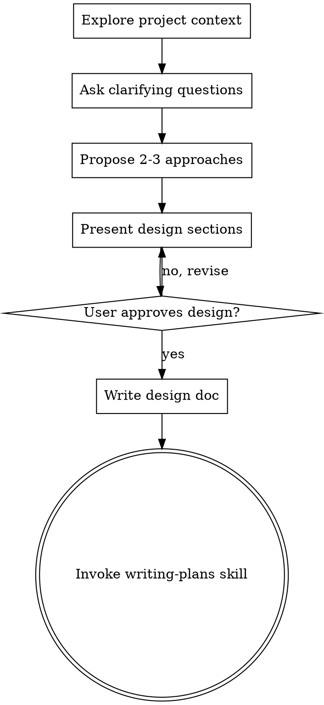

# Brainstorming Ideas Into Designs

## Overview

Help turn ideas for AI Founder Operator features into fully formed designs and specs through natural collaborative dialogue.

Start by understanding the current project context (Rails API, SMS interface, AI processing, business insights), then ask questions one at a time to refine the idea. Once you understand what you're building, present the design and get user approval.

<HARD-GATE>
Do NOT invoke any implementation skill, write any code, scaffold any project, or take any implementation action until you have presented a design and the user has approved it. This applies to EVERY project regardless of perceived simplicity.
</HARD-GATE>

## Anti-Pattern: "This Is Too Simple To Need A Design"

Every project goes through this process. A todo list, a single-function utility, a config change — all of them. "Simple" projects are where unexamined assumptions cause the most wasted work. The design can be short (a few sentences for truly simple projects), but you MUST present it and get approval.

## Checklist

You MUST create a task for each of these items and complete them in order:

1. **Explore project context** — check files, docs, recent commits
2. **Ask clarifying questions** — one at a time, understand purpose/constraints/success criteria
3. **Propose 2-3 approaches** — with trade-offs and your recommendation
4. **Present design** — in sections scaled to their complexity, get user approval after each section
5. **Write design doc** — save to `docs/plans/YYYY-MM-DD-<topic>-design.md` and commit
6. **Transition to implementation** — invoke writing-plans skill to create implementation plan

## Process Flow

**The terminal state is invoking writing-plans.** Do NOT invoke frontend-design, mcp-builder, or any other implementation skill. The ONLY skill you invoke after brainstorming is writing-plans.

## The Process

**Understanding the idea:**
- Check out the current project state first (models, controllers, jobs, routes, specs)
- Review existing patterns: how SMS is handled, how AI processing works, how business data is accessed
- Ask questions one at a time to refine the idea
- Prefer multiple choice questions when possible, but open-ended is fine too
- Only one question per message - if a topic needs more exploration, break it into multiple questions
- Focus on understanding: purpose, constraints, success criteria, SMS considerations

**Exploring approaches:**
- Propose 2-3 different approaches with trade-offs
- Consider Rails patterns: controllers vs services, sync vs async jobs, ActiveRecord vs raw SQL
- Present options conversationally with your recommendation and reasoning
- Lead with your recommended option and explain why

**Presenting the design:**
- Once you believe you understand what you're building, present the design
- Scale each section to its complexity: a few sentences if straightforward, up to 200-300 words if nuanced
- Ask after each section whether it looks right so far
- Cover relevant sections: API endpoints, models/schema, business logic (services/jobs), Twilio integration, AI processing, error handling, SMS response formatting, testing strategy
- Be ready to go back and clarify if something doesn't make sense

## After the Design

**Documentation:**
- Write the validated design to `docs/plans/YYYY-MM-DD-<topic>-design.md`
- Include sections relevant to the feature: API endpoints, data models, business logic, SMS/Twilio considerations, AI integration, error handling
- Use elements-of-style:writing-clearly-and-concisely skill if available
- Commit the design document to git

**Implementation:**
- Invoke the writing-plans skill to create a detailed implementation plan
- Do NOT invoke any other skill. writing-plans is the next step.

## Rails API-Specific Considerations

When designing features for this project, consider:

**SMS Constraints:**
- Message length limits (160 chars for single SMS, segmentation for longer)
- Async nature of SMS communication
- Twilio webhook validation and security
- Error handling when messages fail to send

**AI Processing:**
- Token limits and API costs
- Response time considerations (async processing recommended)
- Prompt design for business context
- Validation of AI responses before sending

**Business Data:**
- What data sources are needed for the insight?
- How is business data accessed and validated?
- Privacy and security of business metrics
- Time zones and business calendars

**API Design:**
- RESTful conventions
- JSON response formats
- Error responses that don't leak sensitive information
- Authentication/authorization if needed

## Key Principles

- **One question at a time** - Don't overwhelm with multiple questions
- **Multiple choice preferred** - Easier to answer than open-ended when possible
- **YAGNI ruthlessly** - Remove unnecessary features from all designs
- **Explore alternatives** - Always propose 2-3 approaches before settling
- **Incremental validation** - Present design, get approval before moving on
- **Be flexible** - Go back and clarify when something doesn't make sense
- **SMS-first thinking** - Design for mobile, async, message length constraints
- **Business context matters** - Insights must be accurate and actionable for founders
- **Cost-aware AI** - Consider token usage and API costs in design
- **Rails conventions** - Follow Rails patterns unless there's a compelling reason not to
